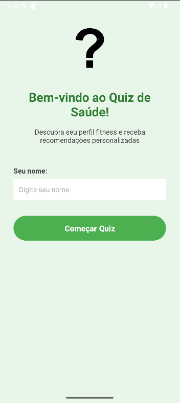
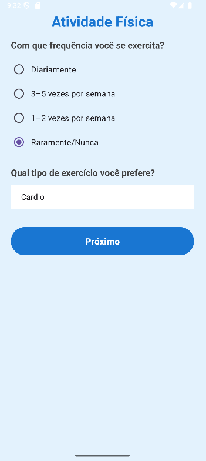
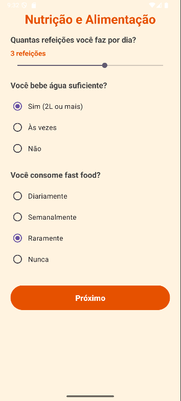
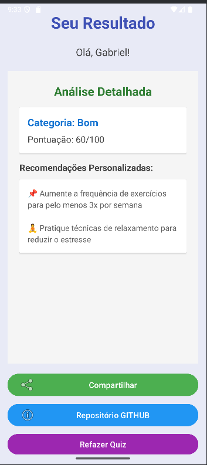

# 🏃‍♂️ AP2 - Aplicativo de Saúde e Bem-Estar

## 📱 Descrição

Aplicativo Android desenvolvido em Kotlin para avaliação de hábitos de saúde e bem-estar. O app coleta informações sobre atividade física, nutrição e estilo de vida do usuário, gerando uma pontuação personalizada com recomendações de melhoria.

**Desenvolvido por:** Gabriel  
**Repositório:** [https://github.com/sica14/AP2DEVMOBILE](https://github.com/sica14/AP2DEVMOBILE)

## 🎯 Funcionalidades

- **Tela Inicial:** Cadastro do nome do usuário
- **Avaliação de Atividade Física:** Questionário sobre frequência e intensidade de exercícios
- **Avaliação de Nutrição:** Perguntas sobre hábitos alimentares e consumo de água
- **Avaliação de Estilo de Vida:** Análise de sono e níveis de estresse
- **Resultado Personalizado:** Pontuação total com feedback específico e recomendações

## 🛠️ Tecnologias Utilizadas

- **Linguagem:** Kotlin
- **Plataforma:** Android
- **UI:** XML Layouts com ConstraintLayout
- **Componentes:** Activities, Intents, Fragments
- **Mínimo SDK:** Android 5.0 (API 21)

## 🎨 Views e Componentes UI Utilizados

### Layouts
- **ConstraintLayout** - Layout principal para posicionamento flexível de componentes
- **ScrollView** - Permite rolagem de conteúdo em telas com muitas perguntas
- **LinearLayout** - Organização vertical/horizontal de elementos
- **CardView** - Cartões para exibição de informações com elevação

### Componentes de Input
- **EditText** - Campo de entrada de texto (nome do usuário)
- **RadioButton / RadioGroup** - Seleção única entre múltiplas opções
- **SeekBar** - Controle deslizante para valores numéricos (horas de sono, refeições)
- **Spinner** - Lista suspensa para seleção de opções (tipo de exercício)
- **Button** - Botões de ação e navegação

### Componentes de Exibição
- **TextView** - Exibição de textos, títulos, perguntas e resultados
- **ImageView** - Exibição da logo do aplicativo
- **CheckBox** - Seleção múltipla de opções (hábitos alimentares)

### Componentes Avançados
- **Fragment** - Componente reutilizável para exibir detalhes dos resultados
- **FrameLayout** - Container para hospedar fragments

## 📋 Pré-requisitos

- Android Studio (versão mais recente recomendada)
- JDK 8 ou superior
- Dispositivo Android ou Emulador com API 21+

## 🚀 Como Executar

### 1. Clone o repositório
```bash
git clone https://github.com/sica14/AP2DEVMOBILE.git
cd AP2
```

### 2. Abra no Android Studio
- Abra o Android Studio
- Selecione **File > Open**
- Navegue até a pasta do projeto e selecione
- Aguarde o Gradle sincronizar as dependências

### 3. Execute o aplicativo
- Conecte um dispositivo Android via USB (com depuração USB ativada) **OU**
- Inicie um emulador Android
- Clique no botão **Run** (▶️) ou pressione `Shift + F10`
- Selecione o dispositivo/emulador e aguarde a instalação

### 4. Alternativa: Build APK
```bash
# No terminal do Android Studio ou prompt de comando
gradlew assembleDebug

# O APK será gerado em:
# app/build/outputs/apk/debug/app-debug.apk
```

## 📸 Screenshots

### Tela Principal


### Questionário de Atividade Física


### Questionário de Nutrição


### Questionário de Estilo de Vida


### Tela de Resultados


---

## 📖 Estrutura do Projeto

```
app/src/main/
├── java/com/example/ap2/
│   ├── MainActivity.kt                 # Tela inicial
│   ├── AtividadeFisicaActivity.kt     # Questionário de atividade física
│   ├── NutricaoActivity.kt            # Questionário de nutrição
│   ├── EstiloVidaActivity.kt          # Questionário de estilo de vida
│   ├── ResultadoActivity.kt           # Tela de resultados
│   ├── ResultFragment.kt              # Fragment com detalhes dos resultados
│   └── UserData.kt                    # Modelo de dados do usuário
├── res/
│   ├── layout/                         # Arquivos XML de interface
│   ├── values/                         # Strings, cores, temas
│   └── drawable/                       # Recursos gráficos
└── AndroidManifest.xml                 # Configuração do app
```

## 🎓 Sobre o Projeto

Este aplicativo foi desenvolvido como parte da avaliação AP2 da disciplina de Desenvolvimento Mobile. O objetivo é demonstrar conhecimentos em:

- Navegação entre Activities
- Passagem de dados via Intent
- Manipulação de componentes de UI (EditText, RadioButton, Button, etc.)
- Uso de Fragments
- Lógica condicional e cálculo de pontuações
- Boas práticas de desenvolvimento Android

## 📄 Licença

Este projeto é de uso educacional.

---

**Desenvolvedor:** Gabriel  
**GitHub:** [@sica14](https://github.com/sica14)  
**Projeto:** AP2 - Desenvolvimento Mobile

